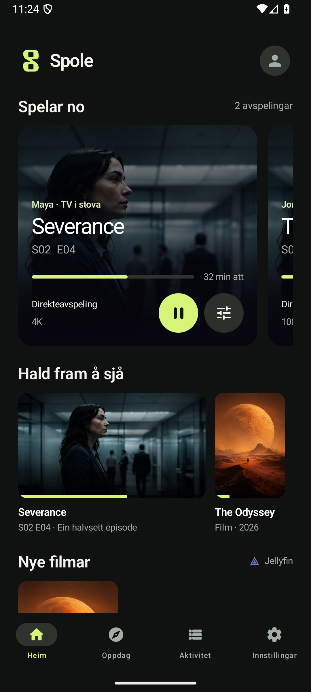
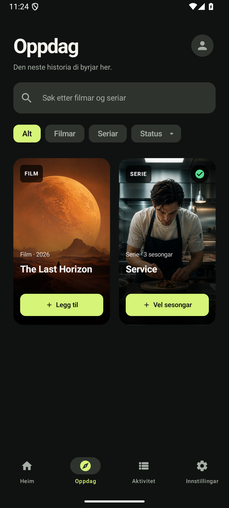
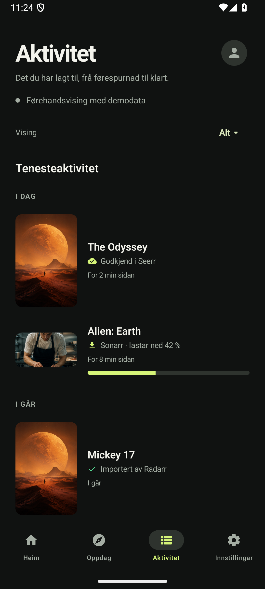

<p align="center">
  
</p>

<h1 align="center">Spole</h1>

<p align="center">Filmane dine. Seriane dine. Éin stad.</p>

<p align="center">Jellyfin · Emby · Seerr · Radarr · Sonarr</p>

<p align="center">
  <a href="https://github.com/oyvhov/spole-android/releases/latest"><strong>↓ Last ned for Android</strong></a>
  &nbsp; · &nbsp;
  <a href="https://github.com/oyvhov/spole-android/releases">Kva er nytt?</a>
</p>

---

Spole samlar medietenestene dine i ein innfødd Android-app. Eit mørkt, roleg uttrykk, mjuke overgangar og innhaldet i sentrum — på nynorsk.

## Ein liten kikk

<p align="center">
  
  &nbsp;
  
  &nbsp;
  
</p>

<p align="center"><sub>Heim · Oppdag · Aktivitet — skjermbilete frå Spole 0.13.2 med demodata.</sub></p>

## Dette får du

- **Biblioteka dine samla.** Eigne film- og episoderader frå Jellyfin og Emby, utan å byte tenar.
- **Finn noko nytt.** Søk etter filmar og seriar, les detaljar og legg til manglande sesongar gjennom Seerr.
- **Følg det du har lagt til.** Frå førespurnad til bibliotek, med valfrie varsel.
- **Sjå kva som kjem.** Komande heimeutgjevingar og episodar frå Radarr og Sonarr, med kalender.
- **Di eiga oppleving.** Profil, personlege førespurnader og val for kva framsida skal vise. Tenesterettane avgjer tilgangen.

## Kom i gang

1. Last ned APK-en frå [siste release](https://github.com/oyvhov/spole-android/releases/latest).
2. Installer på Android 8.0 eller nyare.
3. Legg til tenesteadressene dine og logg inn. Du kan òg prøve demovisninga først.

Du treng eigne medietenester; Spole leverer ikkje filmar eller seriar. Repoet er privat, så nedlasting krev GitHub-tilgang. Oppdateringar kan installerast over eksisterande app.

<details>
<summary>For utviklarar</summary>

Bygd med Kotlin og Jetpack Compose. Opne prosjektet i Android Studio, eller bygg lokalt:

```powershell
.\gradlew.bat assembleDebug
.\gradlew.bat testDebugUnitTest lintDebug
```

[Arbeidsrettleiing](docs/AI_INSTRUCTIONS.md) · [Produktplan](docs/PRODUCT_PLAN.md) · [Tilgang og personvern](docs/VIEWER_ACCESS.md) · [Design og logo](docs/SPOLE_BRAND.md)

</details>
