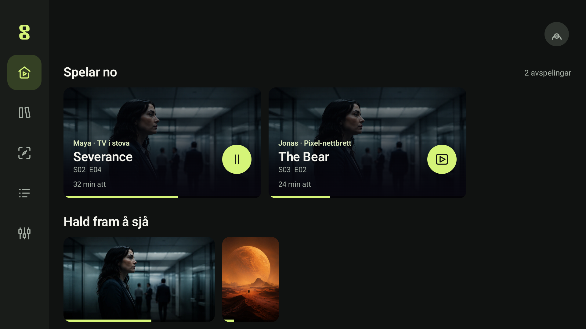
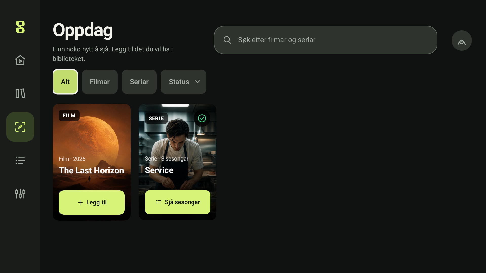
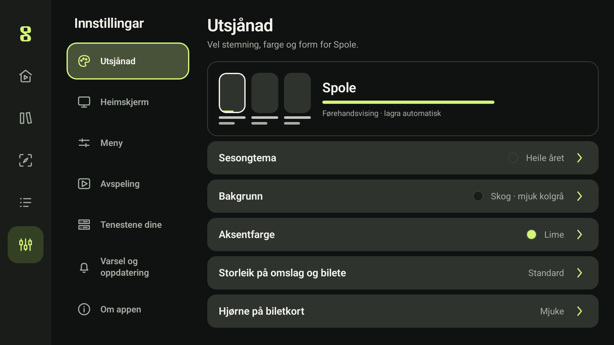
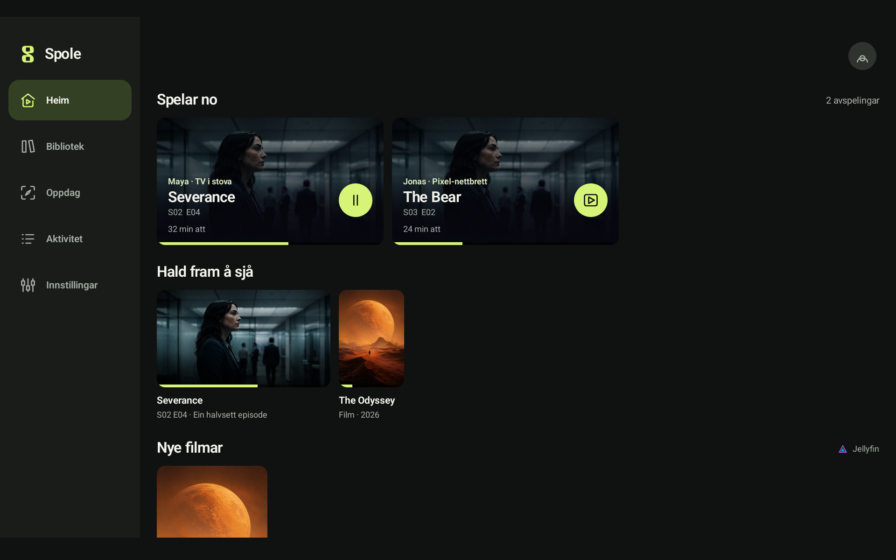
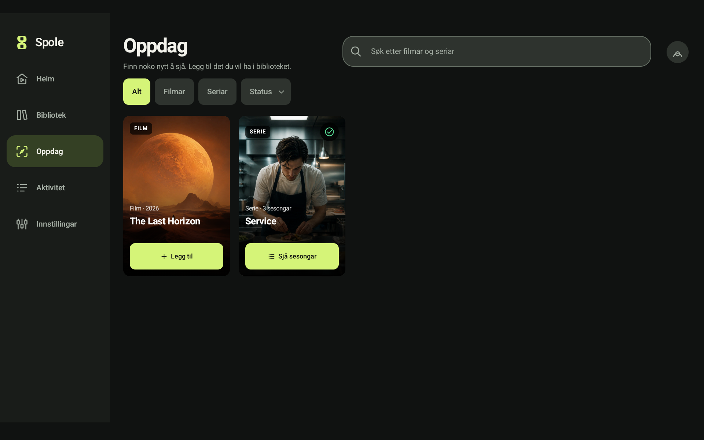
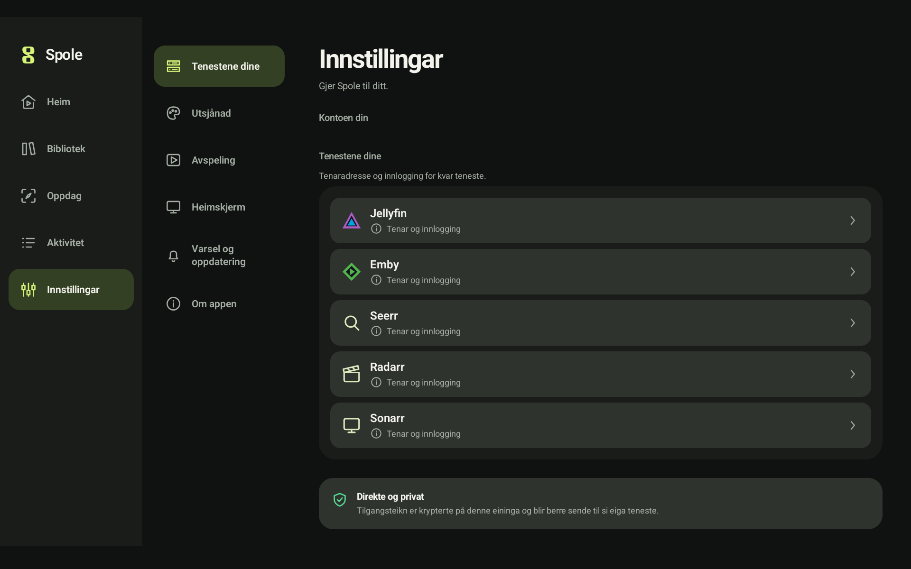
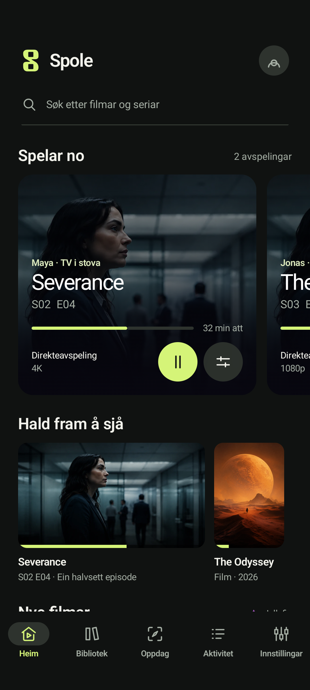
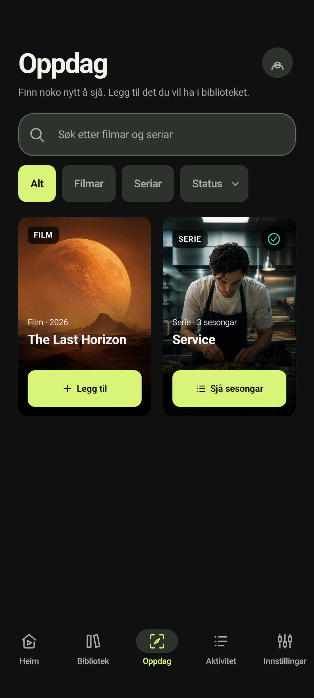
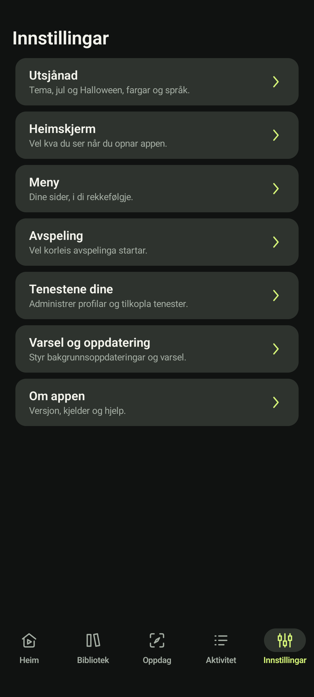

# Spole på TV, nettbrett og telefon

Skjermbileta er tekne 13. september 2026 av den faktiske Compose-appen i ei utviklingsutgåve
etter 0.16.0-alpha24. Dei er ikkje designskisser. Sjå merkinga i hovud-README for kva som er publisert.

## Personvern og opphav

- Berre isolerte instrumenteringseiningar og appen sine demodata er brukte.
- Ingen private kontoar, eigne tenaradresser, e-postadresser, tilgangsteikn eller innloggingskodar er med.
- Namn og aktivitet i demovisninga er oppdikta, og seier ingenting om faktisk sjåarhistorikk.
- Kontoopplysningar er utelatne før biletet blir teke; dei er ikkje berre sladda med eit gjennomsiktig lag.
- Bileta er visuelt kontrollerte før publisering. Innhaldskunst kjem frå appen sine eksisterande demoressursar.
- TV-bileta bruker TV-modus. Nettbrettbileta er tekne i eit emulert nettbrettvindauge på 1920 × 1200 pikslar.
  Telefonbileta bruker den eksisterande isolerte telefonprofilen. Ingen fysisk eining er brukt til desse bileta.

## TV

## Nettbrett

## Telefon

  
  
  

Reproduserbar fangst ligg i PublicScreenshotsTest på utviklingsgreina.
Testen må berre køyrast på isolerte testeiningar, aldri på ein profil med ekte kontoar.
