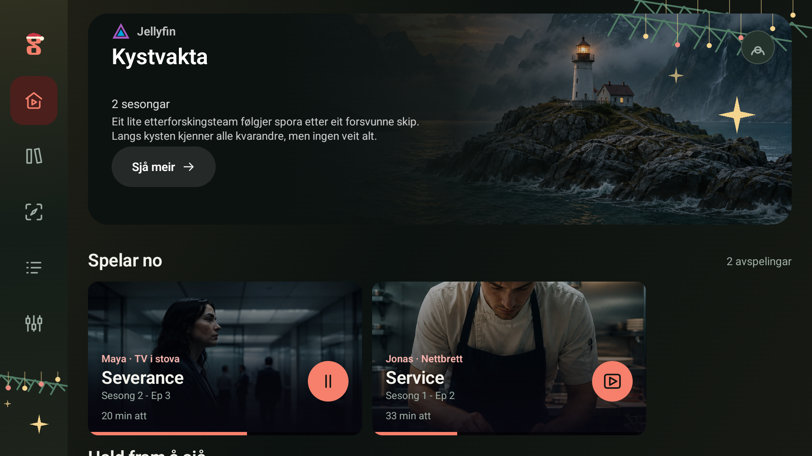
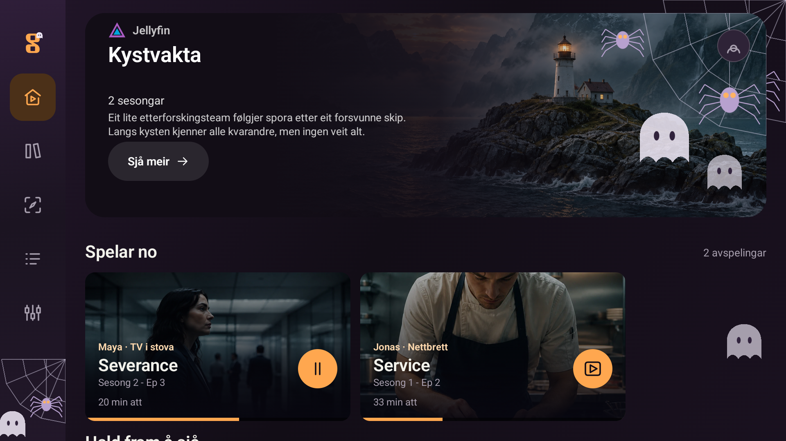
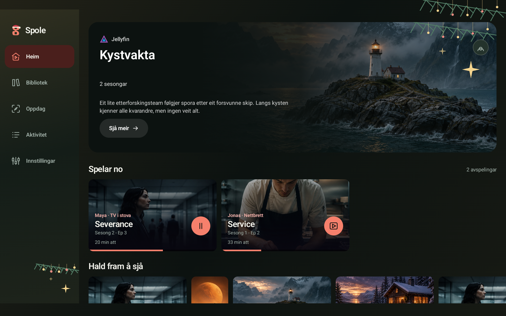
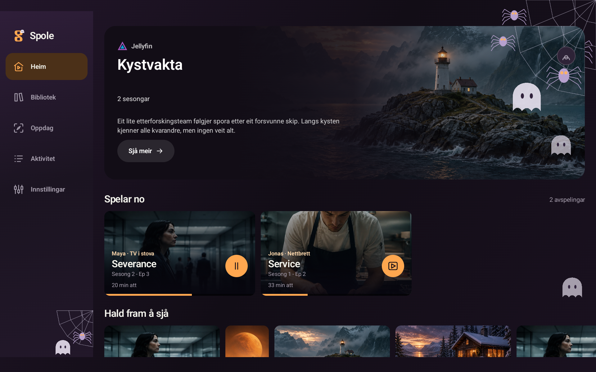
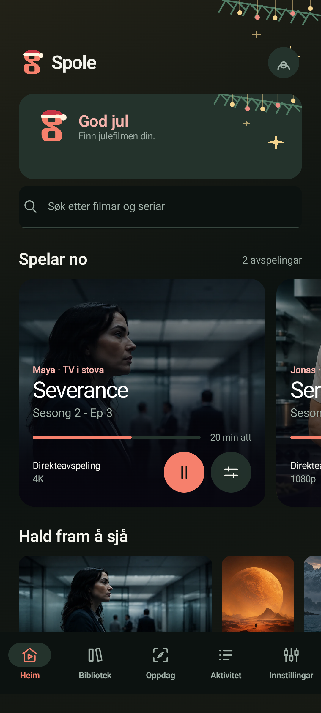
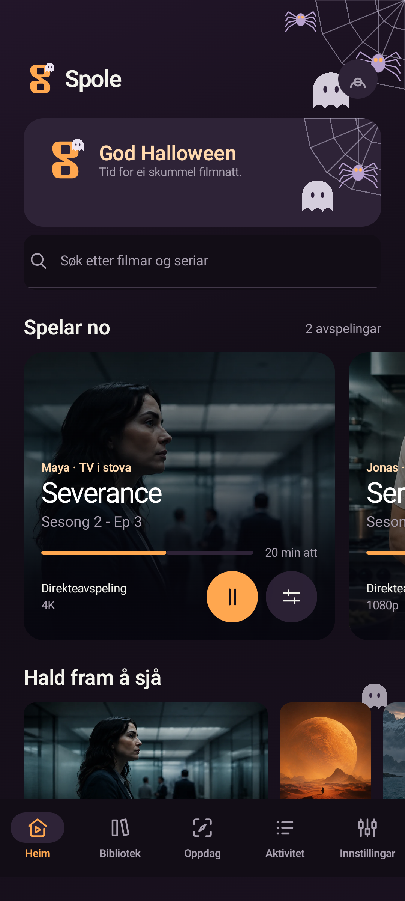

# Spole on TV, tablet and phone

These anonymised reference screenshots were captured on September 13, 2026 from the
Compose app on isolated test devices. They document the TV, tablet and phone layouts;
the current public APK is listed on the repository [Releases](https://github.com/oyvhov/spole-android/releases) page.

## Privacy and provenance

- Only isolated test devices and the app's demo data were used.
- No private accounts, personal server addresses, email addresses, access tokens or login codes are included.
- Names and activity in the demo are fictional and do not represent real viewing history.
- Account details were removed before capture; they are not merely hidden by an overlay.
- The images were visually checked before publication. They are not evidence of a real-account test.
- Ratings, titles and activity shown in the demo are example data.
- Seasonal screenshots use reduced motion for stable captures and show static decoration.
- TV screenshots use TV mode. Tablet screenshots use a 1920 x 1200 emulated tablet window. Phone screenshots use the existing isolated phone profile.

## TV

## Tablet

## Phone

  
  
  

## Christmas and Halloween

### TV

### Tablet

### Phone

  
  

`PublicScreenshotsTest` can produce replacement demo captures only when the
`captureScreenshots=true` instrumentation argument is supplied. Run it only on
isolated test devices, never on a profile containing real accounts.
